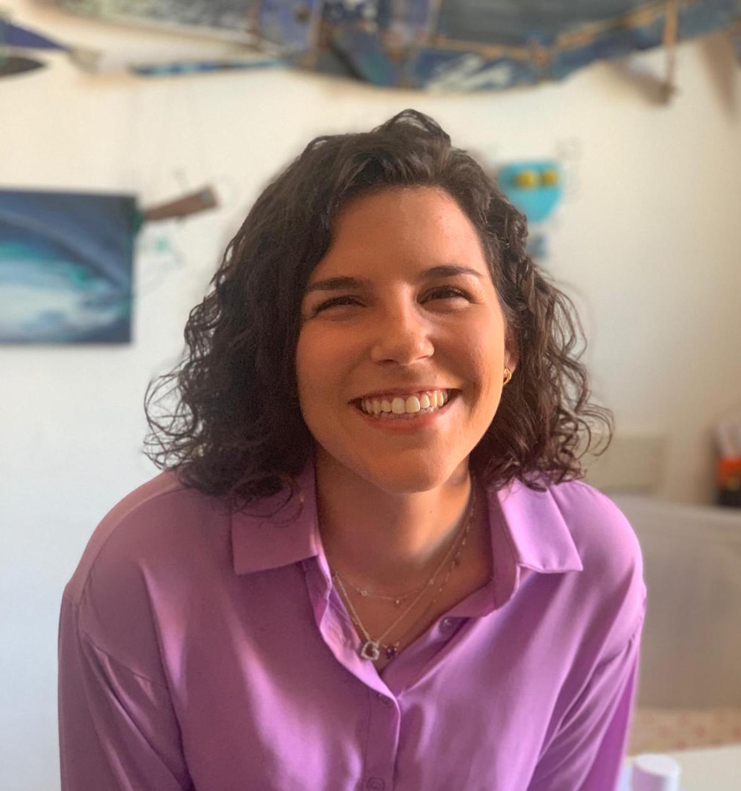

## About

Hi! I am Marta Marchiori Manerba, Master's student of <a href="https://infouma.fileli.unipi.it/laurea-magistrale/percorsi-formativi/tlin/" target="_blank">Digital Humanities - Language Technologies</a>, at University of Pisa in Italy :)

## Research Interests

NLP; XAI; Fairness in ML; Algorithmic bias; Algorithmic Auditing; Digital Discrimination; Intersectionality; Hate Speech Detection

## Education summary and academic experiences

*Full version in CV (with all the links)*

Year | Institution | Description
-----|--------------------------------------------------------------------------------------|--------------------------------------------
2021 | Knowledge Discovery and Data Mining Laboratory: Ethical, Trustworthy, Interactive AI, with Professor Riccardo Guidotti | On-going Master’s thesis project within the field of Explainable Artificial Intelligence (XAI)
2020 | Fondazione Bruno Kessler, Digital Humanities group | Traineeship on Fairness analysis for abusive language detection systems detecting unintended models biases
2020 | University of Pisa | Academic Tutor of the course Programming and Theoretical Fundamentals
2020 | University of Pisa | On-going Master's Degree in Digital Humanities: Language Technologies
2019 | University of Pisa | Bachelor's Degree in Digital Humanities: Thesis project carried out in the field of Assistive Technology for Education

## Publications and academic writing 

* I wrote a post on the blog of Digital Humanities Group at FBK, titled <a href="https://dh.fbk.eu/2021/02/discriminazioni-algoritmiche-tra-pregiudizi-umani-e-decisioni-automatiche/" target="_blank">Algorithmic discrimination, between human biases and automatic decisions</a>, at the end of the internship there. It was really a chance to refocus and discover how passionate I am about these topics (it's in Italian, sooner or later I will translate it)

---

## Courses, Seminars, Workshops

*As audience*

* **ACM FAccT 2021**, Conference on Fairness, Accountability, and Transparency
* **CLIC-IT 2020**, Seventh Italian Conference on Computational Linguistics
* <a href="https://aiucd2021.labcd.unipi.it/" target="_blank">AIUCD2021</a>, as Assistant moderator :)

---

## Member of 

* <a href="https://krino.org/" target="_blank">KRINO</a>, cultural association that organizes panels, workshops and events within the field of Digital Humanities, with the aim of integrating and contaminating sciences and arts
* <a href="https://www.ai-lc.it/en/" target="_blank">AILC</a>, Italian Association of Computational Linguistics
* <a href="http://www.aiucd.it/" target="_blank">AIUCD</a>, Digital Humanities and Digital Culture Association

## Communities, people and projects that inspire me 

* <a href="https://www.ajl.org/about" target="_blank">Algorithmic Justice League</a>
* <a href="https://www.masakhane.io/" target="_blank">Masakhane</a>
* <a href="https://www.turing.ac.uk/research/data-ethics" target="_blank">Data ethics</a> at The Alan Turing Institute
* <a href="https://digitalethicslab.oii.ox.ac.uk/" target="_blank">Digital Ethics Lab</a>: Every Bit as Good
* <a href="https://www.radicalai.org/" target="_blank">The Radical AI Podcast</a>
* <a href="https://www.skynettoday.com/" target="_blank">Skynet Today</a>: Putting AI News In Perspective
* <a href="https://algorithmwatch.org/en/" target="_blank">AlgorithmWatch</a>

> growth is a process Rupi Kaur »

